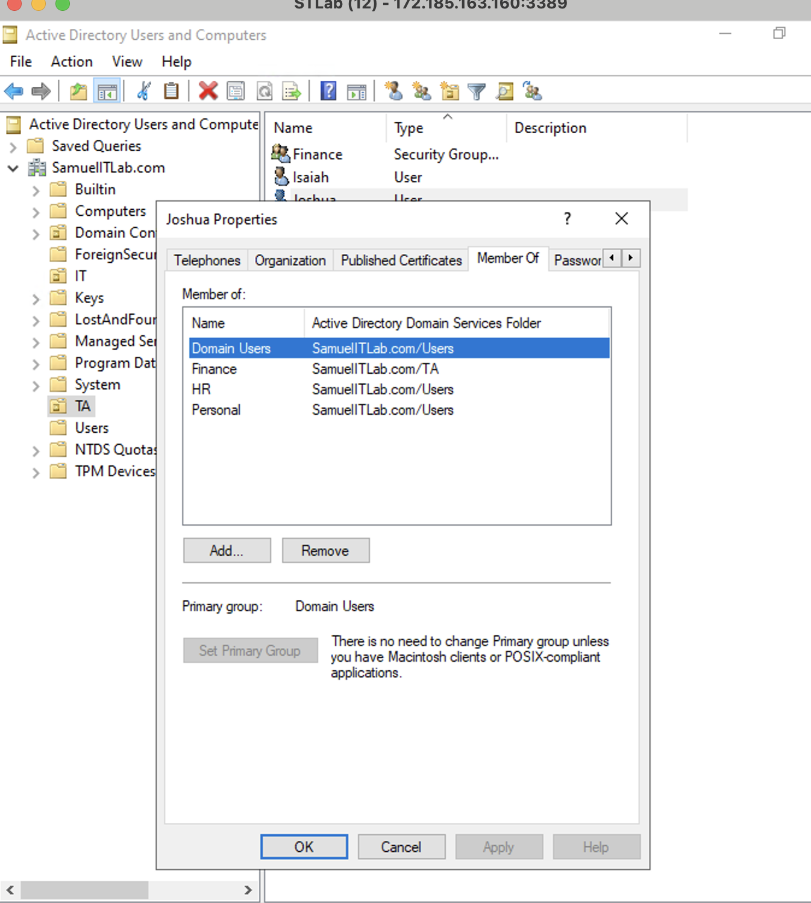
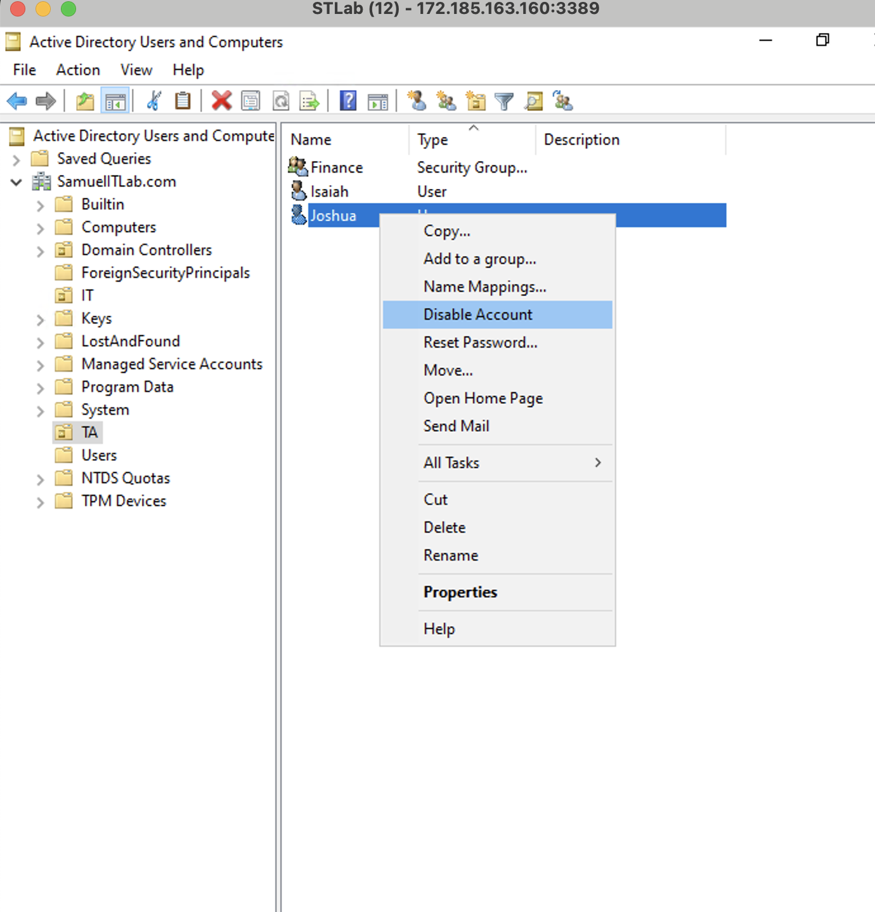

## What is Active Directory?

Active Directory is a Microsoft directory service that enables administrators to centrally manage a company’s users, computers, and other network resources. It is used to control access to resources and enforce security policies.

---
## Active Directory Domain Services Installation

1. Open **Server Manager**
2. Click **Next**
3. Select **Role-based or feature-based installation**
4. Click **Next**
5. Click on **Active Directory Domain Services**
6. Click **Add Features**
7. Click **Next**, then **Install**
8. Click **Promote this server to a domain controller**
9. Select **Add a new forest**
10. Enter the **Root domain name** (e.g. SamuelITLab.com)
11. Create a password
12. Click **Next**
13. Wait for **Prerequisites check**
14. Click **Install**, it will restart your computer

---
## Creating a New Account in Active Directory

1. Go to **Active Directory Users & Computers**
2. Right-click on **Users**
3. Scroll down to **New** -> **User**
4. Fill in the user’s name and password (can optionally check "User must change password at next login")
5. Click **Finish**
   
---
## Showing More Details About a User
In order to view additional features  
- Right-click on **View**  
- Scroll down to **Advanced Features** and check it.
  
---
## How to Find a User, Contact, or Group in Active Directory

1. Go to **Active Directory Users and Computers**
2. In the left panel, right-click your domain
3. Go to the **Find** option
4. Select the object type (User, Contact, or Group)
5. Set the location to **Entire Directory**
6. Type the name or description of the object
7. Click **Find Now**
   
---
## Enabling Recycle Bin in Active Directory

1. Go to the **Active Directory Administrative Center**
2. Select your **Domain Name**
3. On the right-hand pane, look for **Enable Recycle Bin for Domain Level**
4. Click to enable
   
---
## Creating an Account with the Copy Method

- Fast-tracks account creation; the new account gains all of the group memberships/permissions of the existing account.
1. Right-click on the existing user.
2. Select **Copy.**
3. Enter a **New Username and Password**
4. Click **Next**, then **Finish.**
5. Verify that both accounts have identical group memberships and permissions
   
---
## Creating an OU in Active Directory

1. Go to **Active Directory Users & Computers**
2. Right-click on the Domain Controller
3. New > Organizational Unit > Name it (e.g. HR)
   
---
## Attribute Editor

- Displays detailed properties on an object that are not visible with standard GUI tabs
1. Go to **Active Directory Users & Computers**
2. Click **View** > Enable **Advanced Features**
3. Navigate to the desired object (User, Computer, Group)
4. Right-click the object and select **Properties**
5. Go to the **Attribute Editor** tab
   
---
## Creating Groups in Active Directory
### Group Scope
- **Universal**: Accounts from any domain in the same forest
- **Global**: Accounts from the same domain
- **Domain Local**: Accounts from any domain or any trusted domains

### Group Type
- **Security**: Assigns permissions to shared resources
- **Distribution**: Used to create an email distribution list (i.e. sending emails to a collection of users typically by way of an Exchange Server)
  
### Creating and Adding Members to a Group

1. Go to **Active Directory Users and Computers**
2. Right-click on the OU (doesn’t have to be on an OU) > Select **New** > Click **Group**
3. Configure the group by giving it a name and choosing a group scope and type
4. Right-click on the group you just made > Click **Properties**
   

6. Go to the **Members** tab > Click **Add**
7. Type in the names of the users you want to add
8. Click **Check Names** to verify > Click **OK** to add the users
### Verifying Group Membership

- Open a user’s properties > Go to the **Member Of** tab to see their group memberships
  
---
## Account Management
### How to Reset Passwords

1. Go to **Active Directory Users & Computers** > Select **Domain**
2. Right-click > Find > **Entire Directory**
3. Type the name of the user and find the name
4. Right-click on the user > **Reset Password**
5. Enter the new password and confirm it
   
### How to Unlock a User’s Account

1. Click on the user
2. Go to the **Account** tab
3. Check **Unlock Account**
4. Click **Apply** and **OK**
   
### Disabling and Enabling a User’s Account

1. Right-click on the user profile and select **Disable**
2. To **Enable** the account do the same thing, but select **Enable**
   
### Fixing an Expired Account

1. Click on the **User**
2. Go to the **Account** tab
3. Look for **Account Expires**
4. Reset the end date to what the company mandates.
   
### Moving a User to a Different OU

- Right-click on the user > Click on **Move** > Select the container

